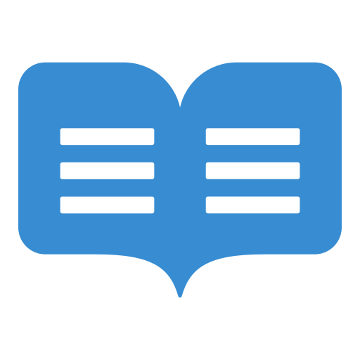

<a name="readme-top"></a>

<div align="center">
  
  <br/>

  <h3><b>README</b></h3>

</div>

<!-- TABLE OF CONTENTS -->

# 📗 Table of Contents

- [📖 About the Project](#about-project)
  - [🛠 Built With](#built-with)
    - [Tech Stack](#tech-stack)
    - [Key Features](#key-features)
  - [🚀 Live Demo](#live-demo)
- [💻 Getting Started](#getting-started)

  - [Prerequisites](#prerequisites)
  - [Setup](#setup)
  - [Install](#install)
  - [Usage](#usage)

  <!-- - [Run tests](#run-tests) -->

  - [Deployment](#deployment)

- [👥 Authors](#authors)
- [🔭 Future Features](#future-features)
- [🤝 Contributing](#contributing)
- [⭐️ Show your support](#support)
- [🙏 Acknowledgements](#acknowledgements)
- [❓ FAQ](#faq)
- [📝 License](#license)

<!-- PROJECT DESCRIPTION -->

# 📖 Portfolio Website <a name="about-project"></a>

**Portfolio Website** is a portfolio template you can rebuild to show your web development skills and experience with visually appealing animations and examples of your best projects. It gives potential employers an insight into what I can bring to their company.

## 🛠 Built With <a name="built-with"></a>

### Tech Stack <a name="tech-stack"></a>

<details>
  <summary>Client</summary>
    <ul>
      <li><a href="https://nextjs.org/">Next.js</a></li><li><a href="https://reactjs.org/">React.js</a></li><li><a href="https://www.typescriptlang.org/">TypeScript</a></li><li><a href="https://tailwindcss.com/">Tailwind CSS</a></li>
    </ul>
</details>

<details>
  <summary>Server</summary>
    <ul>
      <li><a href="https://nextjs.org/">Next.js</a></li><li><a href="https://reactjs.org/">React.js</a></li><li><a href="https://www.typescriptlang.org/">TypeScript</a></li><li><a href="https://resend.com/">Resend</a></li>
    </ul>
</details>

<!-- Features -->

### Key Features <a name="key-features"></a>

- **Showcase projects**
- **Overview of experience and skills**
- **Contact form**

<p align="right">(<a href="#readme-top">back to top</a>)</p>

<!-- LIVE DEMO -->

## 🚀 Live Demo <a name="live-demo"></a>

- [Live Demo Link](https://portfolio-template-next-ts-tailwind.vercel.app)

<p align="right">(<a href="#readme-top">back to top</a>)</p>

<!-- GETTING STARTED -->

## 💻 Getting Started <a name="getting-started"></a>

To get a local copy up and running, follow these steps.

### Prerequisites

In order to run this project you need Node.js installed on your device
false

### Setup

Clone this repository to your desired folder:

```sh
cd my-folder
git clone https://github.com/mohametalmeari/portfolio-template--next-ts-tailwind.git
```

### Install

Install this project with:

```sh
npm install
```

### Usage

To run the project, execute the following command:

```sh
npm run dev
```

<!-- ### Run tests
To run tests, run the following command:
```sh
rspec
``` -->

### Deployment

You can deploy this project on [vercel](https://vercel.com/)

<p align="right">(<a href="#readme-top">back to top</a>)</p>

<!-- AUTHORS -->

## 👥 Authors <a name="authors"></a>

👤 **Mohamad**

- GitHub: [@mohametalmeari](https://github.com/mohametalmeari)
- LinkedIn: [@mohamet-almeari](https://www.linkedin.com/in/mohamet-almeari)

<p align="right">(<a href="#readme-top">back to top</a>)</p>

<!-- FUTURE FEATURES -->

## 🔭 Future Features <a name="future-features"></a>

- **Create unit tests**

<p align="right">(<a href="#readme-top">back to top</a>)</p>

<!-- CONTRIBUTING -->

## 🤝 Contributing <a name="contributing"></a>

Contributions, issues, and feature requests are welcome!

Feel free to check the [issues page](../../issues/).

<p align="right">(<a href="#readme-top">back to top</a>)</p>

<!-- SUPPORT -->

## ⭐️ Show your support <a name="support"></a>

Give a ⭐️ if you like this project!

<p align="right">(<a href="#readme-top">back to top</a>)</p>

<!-- ACKNOWLEDGEMENTS -->

## 🙏 Acknowledgments <a name="acknowledgements"></a>

The original design of this project was built by [Wesley](https://github.com/ByteGrad/portfolio-website)

<p align="right">(<a href="#readme-top">back to top</a>)</p>

<!-- FAQ (optional) -->

## ❓ FAQ <a name="faq"></a>

- **How can I contribute to this project?**
  - You can fork this repository and submit a pull request.

<p align="right">(<a href="#readme-top">back to top</a>)</p>

<!-- LICENSE -->

## 📝 License <a name="license"></a>

This project is [MIT](./LICENSE) licensed.

<p align="right">(<a href="#readme-top">back to top</a>)</p>
